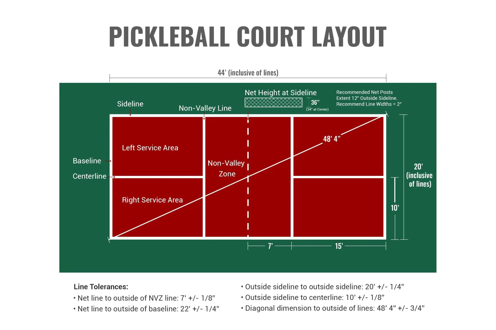

# Pickleball Court Setup with 100-foot Measuring Tape



The total tape length required is **92 feet, 4 inches**. 
This means a standard, widely available **100-foot tape measure** will work perfectly, saving you from having to buy a massive, more expensive commercial size.

---

### Step 1: Fix Your 20-Foot Baseline

1. Pull your tape out to **20 feet** on the ground.
2. Mark **Corner A** at the 0-foot hook, and **Corner B** at the 20-foot mark.
3. Secure both points with a heavy weight or stake, and then let the rest of the tape go slack.

---

### Step 2: The 100-Foot "V-Loop" (Finding Corner C)

Now you are going to use the rest of the tape to form a V-shape that bridges across the two established corners.

1. Keep the **0-foot hook** anchored exactly at **Corner A**.
2. Walk down the court with the tape reel, past where the 44-foot sideline will be.
3. Loop the tape back around and walk it over to **Corner B**.
4. Pull the tape until the **92-foot, 4-inch mark** is directly over Corner B, and pin it down under Corner B's weight.

*(Math check: 92 feet 4 inches minus 44 feet leaves exactly 48 feet 4 inches for your diagonal).*

```
               [Corner C] <-- Pull tight here at the 44ft mark
                   |\
                   |  \
                   |    \
            44ft   |      \    48ft, 4in Diagonally
          Sideline |        \
                   |          \
       [Corner A]  |----20ft----\ [Corner B]
       (0ft Hook)                 (Pinned at 92ft 4in)

```

5. Walk out to the apex of the triangle and grab the tape measure exactly at the **44-foot mark**.
6. Pull that 44-foot mark firmly away from the baseline until the tape is completely straight and tight in both directions.

Where your hand is resting is your perfectly square **Corner C**. Drop a weight right there.

---

### Step 3: Flip it for Corner D

To get your final corner, you just swap the anchors to do the exact same thing on the other side:

1. Keep the **0-foot hook** anchored at **Corner B**.
2. Run the tape down the other sideline, loop it, and pin the **92-foot, 4-inch mark** at **Corner A**.
3. Walk out to the remaining open corner, grab the tape at the **44-foot mark**, and pull it taut.

Drop your weight at that point, and you have **Corner D**. Connect the dots between all four weights with your white snap-line, and you'll have a mathematically perfect, square $44 \times 20\text{-foot}$ playing box using nothing but a standard 100-foot tape.
